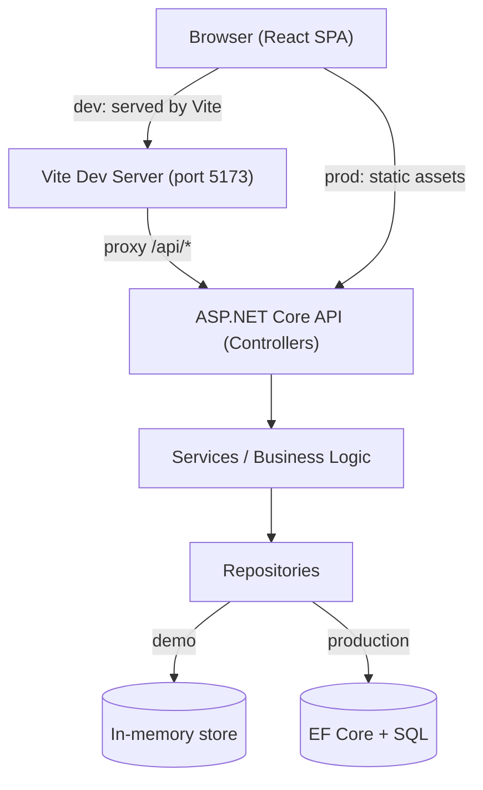
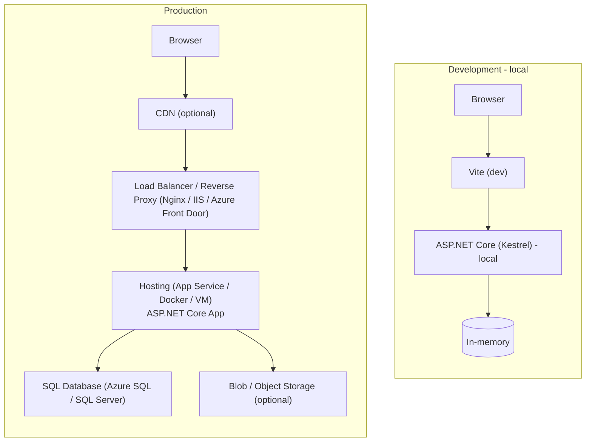

# Architecture

Overview

The app follows a simple two-tier architecture:

- Client: React (Vite) SPA served separately in dev and built/served by ASP.NET in production.
- Server: ASP.NET Core Web API exposing REST endpoints for budgets, categories, and transactions.

Mermaid: Code architecture

Mermaid: Infrastructure architecture (dev vs prod)

Notes
- The server uses an in-memory repository for demo. Replace with EF Core / SQL for production.
